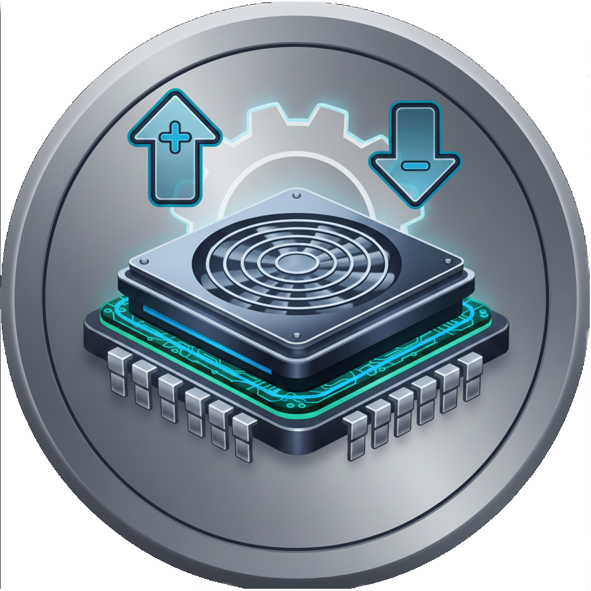
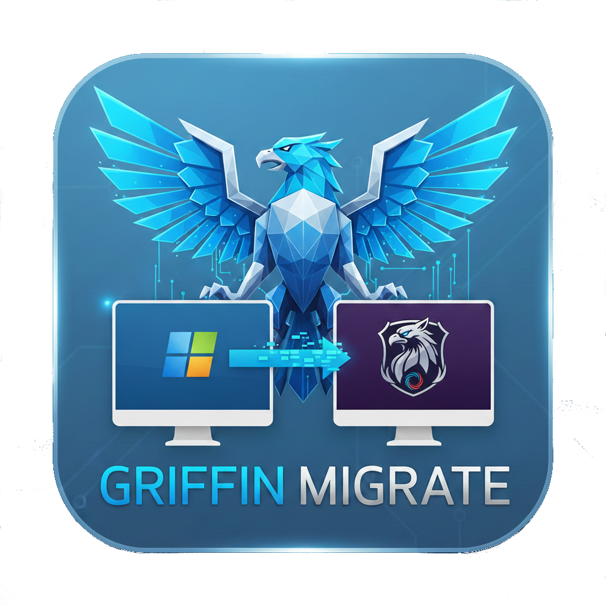
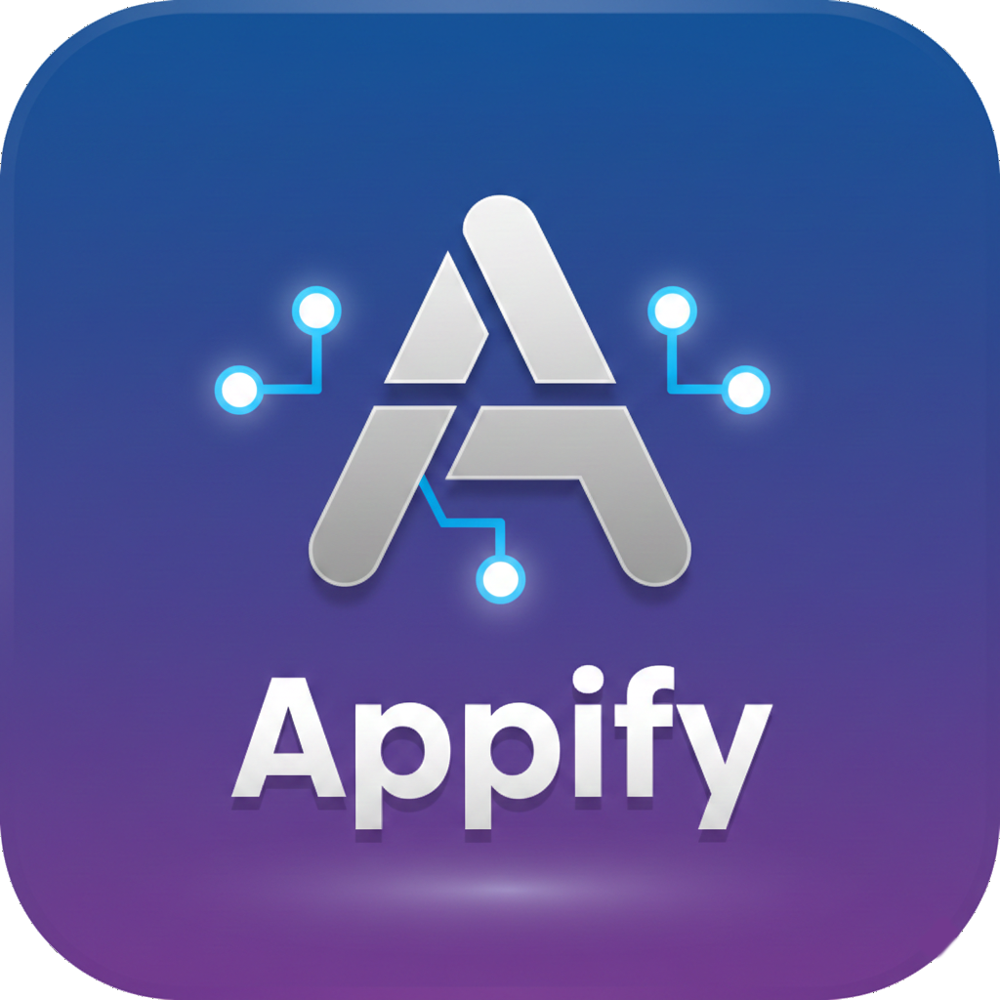
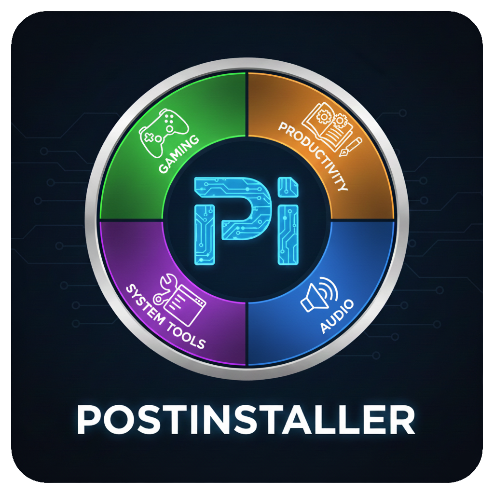
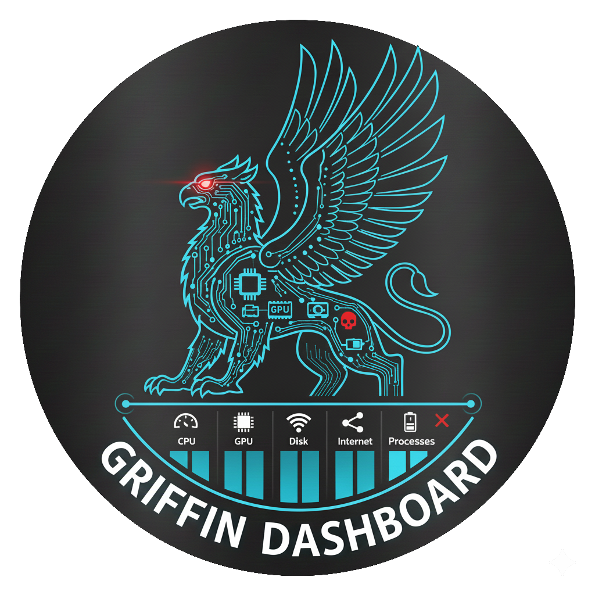

  

# Griffin Linux – The Smartest Way to Switch from Windows **Coming soon in 2026.**

**Griffin Linux** is a user-friendly, gaming-ready Linux distribution designed for Windows users who want a familiar desktop, powerful performance, and intelligent assistance — without the ads, telemetry, or bloat of modern Windows.
Whether you're gaming on the latest RTX, AMD, or Intel hardware, migrating your files and projects, or just browsing — Griffin Linux makes the switch **simple, smart, and powerful**.

## Editions

**Cinnamon (Flagship)**
- Griffin OS based on Linux Mint Cinnamon
- Everyday use, Windows 7/10 feel
- Classic taskbar + modern accents
- mutable (full terminal use for Linux purists)

**XFCE**
- Griffin Aerie based on Linux Mint XFCE
- Older hardware, low resource usage
- Clean and lightweight
- mutable (full terminal use for Linux purists)

**KDE**
- Talon based on Kubuntu KDE Plasma
- Modern Windows 11 look & customization
- Windows 11-inspired layout
- mutable (full terminal use for Linux purists)

All editions include the same powerful Griffin tools and curated repository. Grix will have a lighter version for older hardware and laptops, cloud-only AI models.

## Why Choose Griffin Linux?

- Familiar desktop that feels like home
- Intelligent assistance with Grix
- Gaming-ready out of the box
- No telemetry, ads, or forced updates
- Built on proven Linux Mint stability
- Completely free and community-driven

## Key Features

### Grix – Your Built-in AI Assistant

  
  
<i>Your AI friend.</i>

The ultimate system-aware companion (what Copilot wishes it could be).

- Voice-activated ("Hey Grix")
- Zero telemetry — nothing leaves your machine unless you use cloud AI.
- Local-first — full functionality with local Ollama models.
- No web search — avoids hallucinations; sticks to facts from your documents, system
- Personal Knowledge Base (RAG) 
- You own your data — all notes, todos, reminders, knowledge base stored plainly in ~/Notes/Grix and ~/.config/grix.data, and curated knowledge.
- System Awareness & Proactive Help
- Suggests and applies fixes with your approval
- Securely installs packages (apt, PIP & Flatpak)
- Learning & Education. Teaches Linux step-by-step
- System Diagnostics & Health
- Opt-in Python plugins for advanced users
- Advanced static safety scanner (AST-based). Plugin scanning for malicious code
- Hardened command confirmation mode (toggle in settings)

Fully local voice processing + multi-model AI support.  
If anything breaks or behaves unexpectedly, Grix is there to guide you through diagnosis and recovery.

### Gaming & Performance Suite
Everything is tuned for smooth gameplay and responsiveness:

  

- **ControllerHub** – Auto-detects Xbox, PlayStation, Nintendo, wheels — applies optimal profiles and firmware.

  

- **FanHub** – Windows-style fan curves, profiles, and OpenRGB integration.

  

- **CpuHub** – Easy CPU governor control (performance, balanced, powersave).
- **Sentry** – Smart resource manager using cgroups; learns your habits for smoother multitasking. Includes editable `config.yaml` for advanced users to customize or reverse settings.
- **Auto-Gamemode** – Automatically activates optimizations when launching Steam, Lutris, or Heroic, and triggers Sentry to intelligently throttle background tasks for stutter-free gaming.
- **kernel-autotune** – Detects your hardware (desktop/laptop, RAM, kernel type) and applies optimal baselines (Zram/Zswap, BBR TCP, governors, and more). Fully reversible/customizable via config file for power users.
- **Noatime-autotune** – Simple SSD health optimization.

### Hardware, Kernel, & Driver Tools
No more forum hunting:

  

- **RealtekHub** – Dedicated GUI to fix notorious Realtek WiFi issues.
- **Universal GPU Installer** – Automatically adds latest PPAs and installs optimal drivers for **NVIDIA** (RTX 50-series ready), **AMD** (RDNA4 support), and **Intel**. Detects hardware brand switches and adapts accordingly for seamless transitions.

  

- **XKM** – Manages Xanmod, Liquorix, and Mainline kernels. Installs Xanmod and Liquorix PPAs, removes or installs kernels with DKMS rebuilds, cleans up unused kernels (can be turned off). https://github.com/bobbycomet/XKM-Multi-Kernel-Manager

### Migration & Productivity
Seamless transition from Windows:

  

- **Griffin Migrate** – GUI tool to transfer files, settings, and projects (including Unity/Unreal).

  

- **Appify** – Turn any website into an isolated, native-feeling desktop app (Gmail, Twitch, Discord, cloud gaming). https://github.com/bobbycomet/Appify

  

- **Postinstaller** – One-click category bundles (Gaming, Productivity, Audio, System Tools) — everything you need, instantly.

### Dashboard

  

**Griffin Dashboard** – Real-time Task Manager-like system monitor with per-core and temps CPU graphs, GPU stats and temps, Disk use, RAM use, and process management.

## Community & Support

- Discord: https://discord.gg/7fEt5W7DPh
- Patreon (Early Builds & Support): https://www.patreon.com/c/BobbyComet
- Ko-fi: https://ko-fi.com/bobby60908

## Roadmap

- Full public release of all three editions in 2026
- Expanded Grix capabilities and integrations
- Windows Appify version
- More hardware-specific tools and optimizations

---

**Griffin Linux** – Where power meets simplicity.  
Made for Windows users. Built for everyone.

  
  
<i>Fly higher with Griffin.</i>

